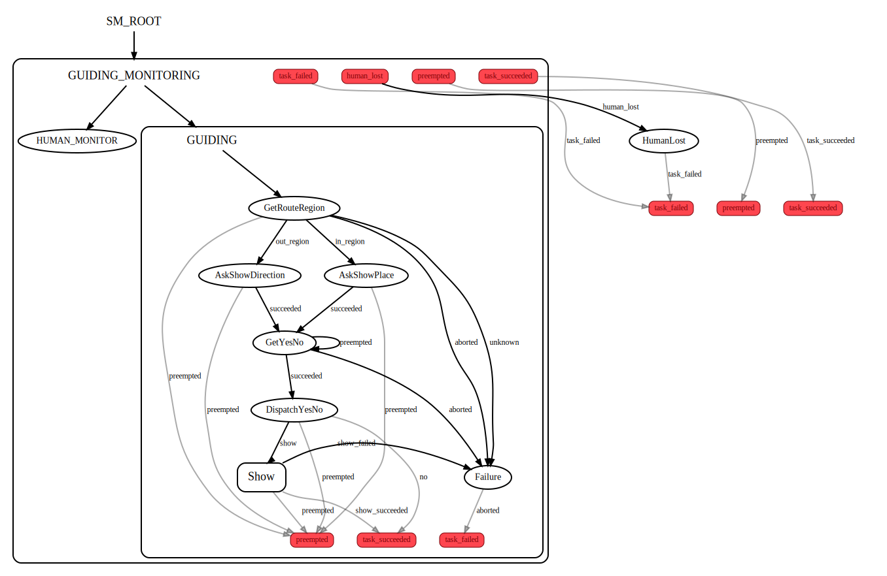
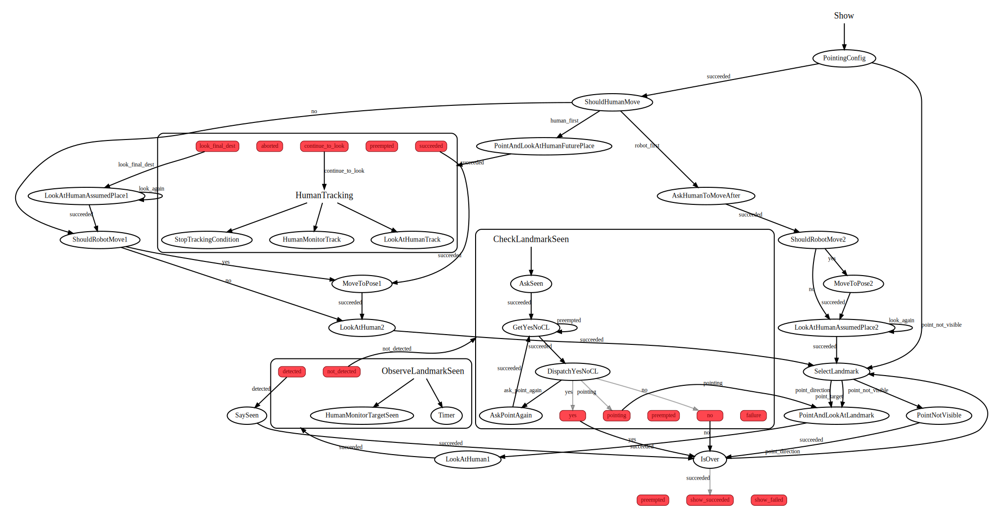

# Package depedencies
- executive_smach
- deictic_gestures
- dialogue
- dialogue_as
- mocap_localization
- naoqi_interfaces
- perspectives_msgs

# Launch dependencies
Launch the nodes, services and action servers it depends on.

Environment - files can be foud here: https://github.com/LAAS-HRI/perspectives
```
roslaunch perspectives bringup_pepper.launch
```

Perspectives - files can be foud here: https://github.com/LAAS-HRI/perspectives
```
uwds start
load_ws
roslaunch perspectives pepper.launch
```

Ontology - launch file can be foud here: https://github.com/LAAS-HRI/perspectives and files here https://github.com/LAAS-HRI/semantic_route_description
```
roslaunch perspectives ontology.launch
```

Other modules - files can be foud here: https://github.com/LAAS-HRI/perspectives
```
roslaunch perspectives mummer.launch
```

Perception (only window n°2):
```
rosrun person_manager start_perception.sh -c config_openpose.ini
```


Dialogue:
```
python -m abcdk.AbcdkSoundReceiver.AbcdkSoundReceiver --qi-url mummer-eth0.laas.fr
roslaunch dialogue LAAS_dialogue.launch # Control the dialogue module on Pepper
rosrun dialogue_as dialogue_as # Dialogue action server to get keywords from a speaker
```


To simulate the navigation action server (just send True to the client):
```
rosrun guiding_as test.py
```
# The state machine
Launch the action server:
```
roslaunch guiding_as guiding_as.launch
```
To start the state machine by sending a goal = a target + a human:
```
rosrun guiding_as guiding_client.py
```
To visualize the state machine and its states:
```
rosrun smach_viewer smach_viewer.py
```




